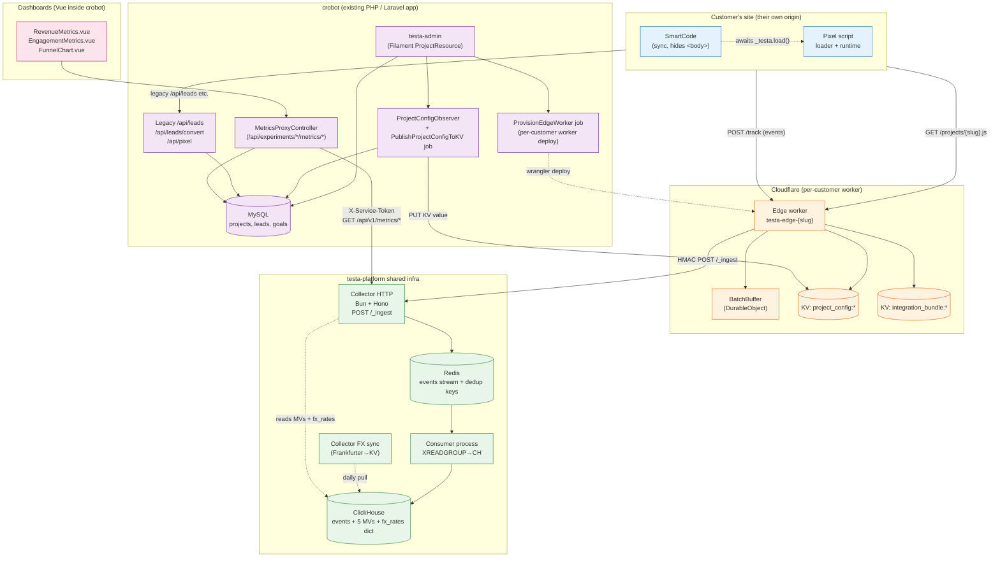
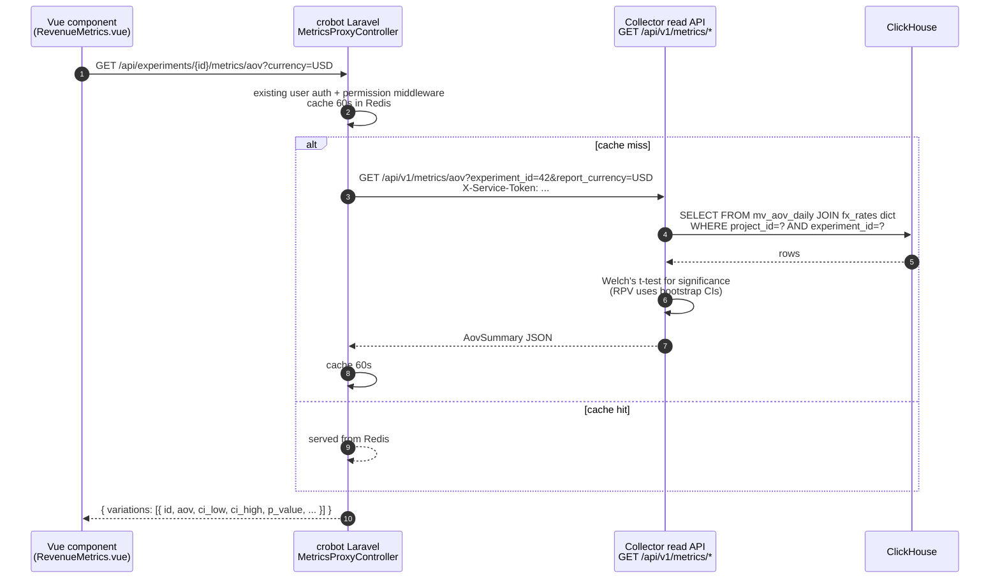
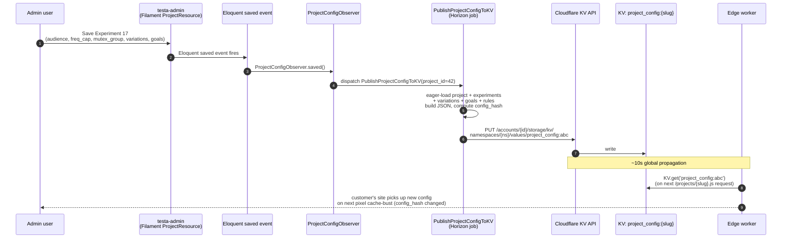
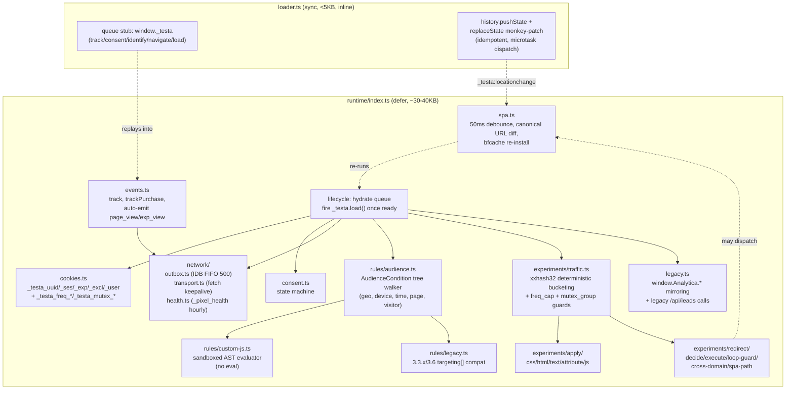
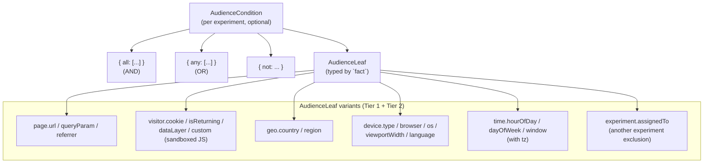
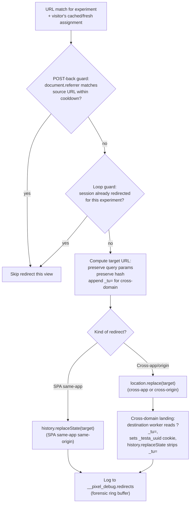
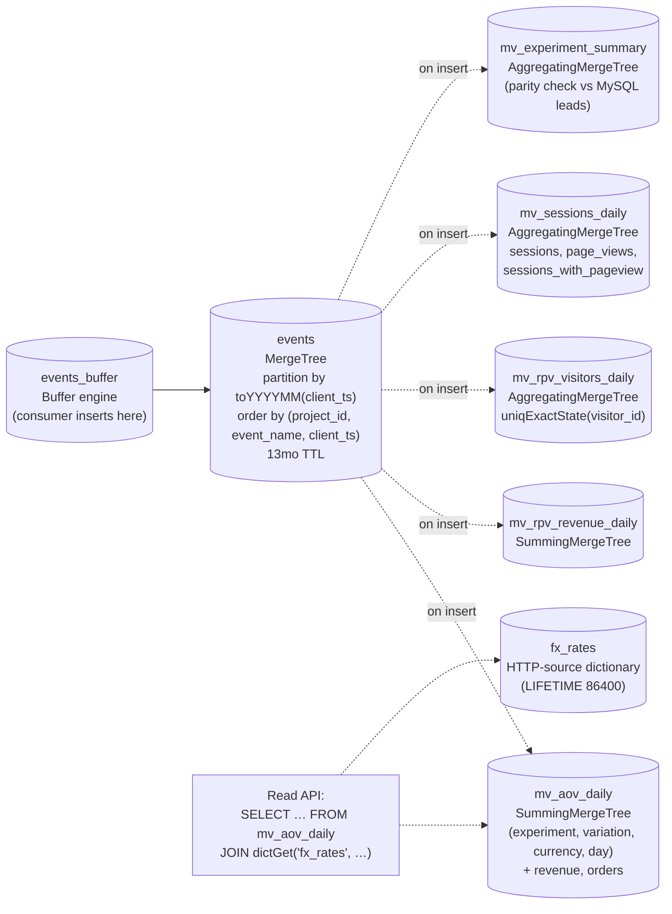

# Architecture — System diagram

Visual reference for the testa-platform system after all 2026-05-06 grilling decisions. Mermaid renders natively on GitHub.

If anything in here drifts from the prose docs (`00-overview.md` … `05-rollout.md`) or the project memory entries, the prose / memory wins — this doc is updated to match, not the reverse.

---

## 1. System overview



**Key invariants** baked into this diagram:

- **Per-customer Edge Worker.** Every customer gets their own CF Worker (`testa-edge-{slug}`) provisioned at signup. Customer traffic spikes scale their worker only. No technical rate limiting; crobot's monthly lead quota is the cap.
- **Pixel is the system of record for experiment decisions.** URL match, audience targeting, variation selection, and redirect target all run in the pixel — not the edge. Edge is a thin gateway.
- **Collector is the only service that talks to ClickHouse.** crobot does NOT have a CH client; it goes through `MetricsProxyController` → collector's read API.
- **Customer's site keeps hitting the legacy `/api/leads` etc.** crobot routes those to MySQL exactly as today; nothing changes for existing dashboards while CH builds up history alongside.

---

## 2. Write path — events flowing browser → CH

```mermaid
sequenceDiagram
  autonumber
  participant U as User's browser
  participant SC as Customer SmartCode
  participant PR as Pixel runtime
  participant IDB as IndexedDB outbox
  participant EW as Edge worker (per-customer)
  participant DO as BatchBuffer DO
  participant CO as Collector HTTP
  participant RD as Redis (stream + dedup keys)
  participant CN as Consumer process
  participant CH as ClickHouse

  Note over U,SC: SmartCode hides &lt;body&gt;
  U->>EW: GET /projects/{slug}.js
  EW->>EW: KV.get('project_config:{slug}')<br/>KV.get('integration_bundle:4.0:loader')<br/>KV.get('integration_bundle:4.0:runtime')
  EW-->>U: loader inline + runtime &lt;script defer&gt;<br/>+ window.cfPrefill
  U->>PR: loader runs (sync), patches history, queues
  U->>PR: runtime hydrates, evaluates audience+experiments
  PR-->>SC: _testa.load() resolves
  SC->>U: un-hide &lt;body&gt;

  loop on each tracked event
    PR->>PR: build PixelEvent (UUIDv7, viewport, utm, ts)
    PR->>IDB: outbox.enqueue(event)
    PR->>EW: POST /track (fetch keepalive, batched)
    EW->>EW: enrich (CF-IPCountry, region, city)<br/>parse UA<br/>bot filter
    EW->>DO: forward to per-host BatchBuffer
    DO->>DO: buffer, alarm at +500ms or flush at 50
    DO->>CO: POST /_ingest (HMAC-signed batch)
    CO->>CO: verify HMAC + ±5min replay window<br/>Zod-validate
    Note over CO,RD: For events in DEDUP_EVENT_NAMES (default ['purchase']):
    CO->>RD: SET event:seen:{event_id} 1 EX 600 NX
    alt SET succeeds (first time)
      CO->>RD: XADD events * payload
    else SET returns nil (duplicate)
      CO->>CO: skip (no XADD)<br/>log _pixel_health late counter
    end
    CO-->>DO: 204
    DO-->>PR: (via 204 to /track)
    PR->>IDB: outbox.markSent(event_id)
  end

  loop consumer drain
    CN->>RD: XREADGROUP collector-writers > BLOCK 5s COUNT 1000
    RD-->>CN: batch of events
    CN->>CH: INSERT INTO events_buffer (JSONEachRow)
    CH->>CH: Buffer engine flushes to events<br/>materialized views update
    CN->>RD: XACK events
  end
```

**Behaviors not visible in the sequence above** (but covered by it):

- On 5xx from `EW → CO`: BatchBuffer retains events, retries with exp backoff (500 ms → 8 s).
- On `pagehide` / `visibilitychange:hidden`: pixel force-flushes IDB via `sendBeacon` fallback.
- On next pageload: pixel drains leftover IDB entries before sending fresh ones — covers tab-close mid-batch.
- Same `event_id` retried any number of times → dedup via SETNX → only one CH row.

---

## 3. Read path — dashboard query → CH MVs



---

## 4. Config publish — admin save → CF KV → edge



---

## 5. Per-customer worker provisioning

```mermaid
flowchart LR
  SIGN[Customer<br/>signup] --> PROV[ProvisionEdgeWorker job<br/>in crobot]
  PROV -->|"reads"| TPL[wrangler.toml.template<br/>+ apps/edge/dist/]
  PROV -->|"CF API"| DEPLOY[wrangler deploy<br/>testa-edge-{slug}]
  DEPLOY --> WORKER[Per-customer Worker<br/>track.{slug}.testa.com<br/>or CNAMEd track.{customer-domain}]
  CODE[apps/edge/ code change] --> CI[CI build]
  CI --> FANOUT[Fan-out deploy<br/>to all customer workers<br/>via CF API]
  FANOUT --> WORKER
  WORKER -.->|"forwards POST /_ingest<br/>(HMAC-signed)"| COLLECTOR[Shared collector]
```

**Why per-customer:** failure isolation, billing isolation, no noisy-neighbor at the edge. Shared `track.testa.com` deployment exists as the **fallback** for customers without CNAME / pre-onboarding.

---

## 6. Pixel internals (apps/pixel)



---

## 7. Audience evaluation tree



Implemented in `apps/pixel/src/rules/audience.ts` (Phase 3.7) with exhaustive `switch (leaf.fact)` so adding a dimension forces a TS compile error in the evaluator until handled.

---

## 8. Redirect engine



Implementation in `apps/pixel/src/runtime/experiments/redirect/` (Phase 3.10). Repro harness across Next 12/13/14 + react-router-dom 6 + plain JS in Phase 3.11.

---

## 9. Data model — what lands in CH



`_pixel_health` events land only in `events` (filtered out of all 5 MVs). Used for drop-rate dashboards.

Schema as of 2026-05-06 includes `client_ts`, `server_ts`, `viewport_w/h`, `tracker_version`, `utm_source/medium/campaign`, `region_subdivision`, `city`. Full DDL in `docs/reference/clickhouse-schema.md`.

---

## 10. What the diagrams omit (intentionally)

- **HMAC details** — see `docs/reference/hmac-protocol.md`.
- **Cookie semantics** — see `docs/architecture/04-cookies-and-consent.md` and `docs/reference/legacy-globals-inventory.md`.
- **Wire format** — see `docs/reference/event-shape.md` and `docs/reference/clickhouse-schema.md`.
- **Audience JSON shape** — see `docs/reference/audience-schema.md`.
- **Pilot rollout / parity check / rollback** — see `docs/architecture/05-rollout.md`.
- **Phase task corpus** (1.x, 2.x, 3.x) — see `tasks/README.md`.

---

## How to update this doc

When any architectural decision changes (or a new memory entry lands in `~/.claude/projects/.../memory/`), update the relevant diagram here. Keep diagram fidelity as a CI checklist item: any prose change in `02-collector.md`, `03-data-model.md`, `05-rollout.md`, etc. that changes a flow direction or component should also touch this file in the same PR.

To preview Mermaid locally: GitHub renders inline. For local: VS Code's Mermaid preview extension or `mermaid-cli` (`mmdc`).
