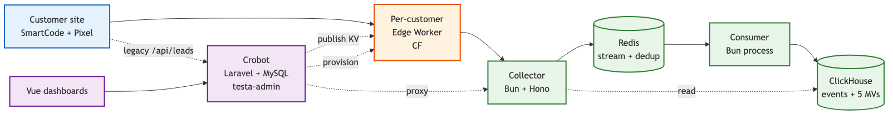
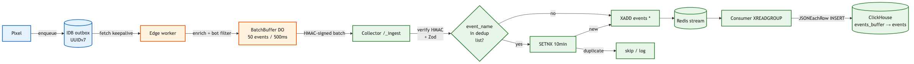
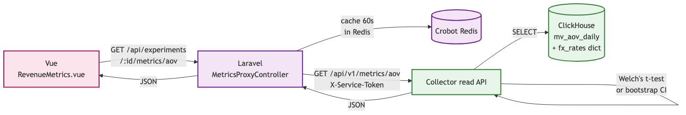
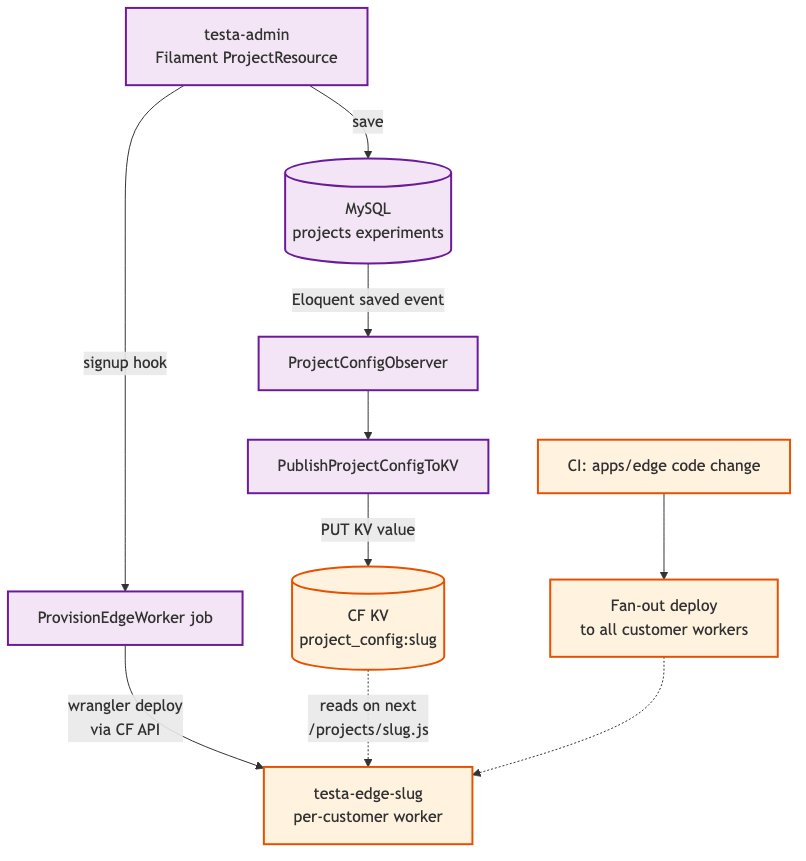
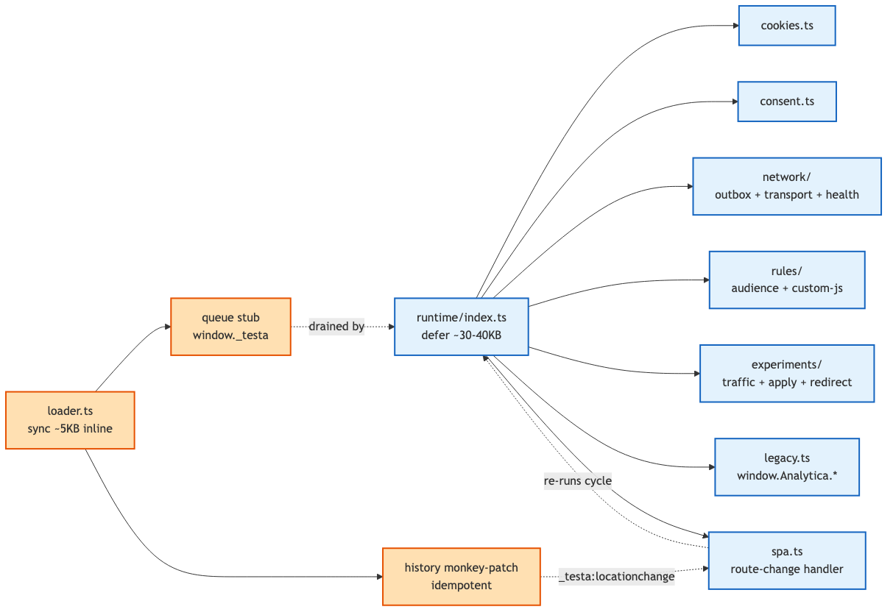

# Architecture — System diagrams

Five rendered PNG diagrams for the testa-platform system after all 2026-05-06 grilling decisions. PNGs render universally — no Mermaid plugin, no SVG-blocking-CSP issues, no security warnings.

Sources are checked into `diagrams/*.mmd`. SVG copies are also kept for vector zoom (some viewers prefer them). Rebuild with `pnpm diagrams`.

If anything in here drifts from the prose docs (`00-overview.md` … `05-rollout.md`) or the project memory entries, the prose / memory wins — this doc is updated to match, not the reverse.

---

## 1. Components

What runs where.

- **Customer site** — their HTML embeds our SmartCode (sync, hides body) + pixel `<script>` (loader + runtime).
- **Per-customer Edge Worker** — one CF Worker per customer, deployed from a wrangler template by crobot's `ProvisionEdgeWorker` job at signup.
- **Collector** — Bun + Hono. The only service that talks to ClickHouse. Two processes: HTTP server (`/_ingest`, read API) + consumer (drains Redis → CH).
- **Redis** — events stream + 10-min dedup keys for SETNX-before-XADD.
- **ClickHouse** — single node, `events` table + 5 materialized views + `fx_rates` HTTP-source dictionary.
- **Crobot** — existing Laravel app. testa-admin authors experiments. `MetricsProxyController` proxies dashboard reads. `ProjectConfigObserver` publishes config to CF KV. Legacy `/api/leads` endpoints stay live for drop-in compat.
- **Vue dashboards** — `RevenueMetrics.vue`, `EngagementMetrics.vue`, `FunnelChart.vue`. Read through crobot's proxy, never directly from CH.

---

## 2. Write path — events landing in ClickHouse

The full chain when a customer's site emits an event.

1. Pixel builds a `PixelEvent` (UUIDv7 event_id, `client_ts`, viewport, utm_*, tracker_version).
2. Outbox writes it to IndexedDB first (durable retry queue, ~500 entries FIFO).
3. Pixel POSTs to the customer's edge worker via `fetch keepalive` (sendBeacon fallback on `pagehide`).
4. Edge enriches (CF-IPCountry, region, city, UA parse, bot filter), buffers in a per-host DurableObject (50 events / 500 ms).
5. DurableObject HMAC-signs the batch and POSTs to the collector's `/_ingest`.
6. Collector verifies HMAC + ±5 min replay window + Zod schema.
7. For each event whose name is in `INGEST_DEDUP_EVENT_NAMES` (default `['purchase']`): `SET event:seen:<event_id> 1 EX 600 NX`. If the SET returns `nil` it's a duplicate → skip the XADD entirely.
8. `XADD events * <payload>` for events that pass the dedup check.
9. Consumer process `XREADGROUP collector-writers > BLOCK 5s COUNT 1000`, parses, batch INSERTs into `events_buffer` (JSONEachRow). CH's Buffer engine flushes to `events` table.
10. The 5 materialized views update on insert.

Same `event_id` retried any number of times (pixel network blip → outbox retries; edge → collector 5xx → DO retries) → only one row in CH for purchase-class events.

---

## 3. Read path — dashboard query → ClickHouse MVs

1. Vue component requests metrics through crobot's existing API.
2. Laravel's `MetricsProxyController` runs the existing user/permission middleware, checks a 60-second Redis cache.
3. On cache miss: GET to collector's read API with `X-Service-Token`.
4. Collector queries materialized views + joins `fx_rates` dictionary for currency conversion.
5. Significance: Welch's t-test for AOV; bootstrap CIs for RPV.
6. JSON response back through the proxy to the Vue component.

The collector does **not** enforce per-experiment authorization — only that the service token matches. Crobot's middleware is the trust boundary for user-level permissions.

---

## 4. Control plane — config publish + worker provisioning

Two flows in one diagram because both run from the same admin actions.

**Config publish:**
1. Admin saves an Experiment / Variation / Goal in testa-admin (Filament).
2. Eloquent `saved` event fires → `ProjectConfigObserver`.
3. Observer dispatches `PublishProjectConfigToKV` job to Horizon.
4. Job builds the JSON config (experiments, audience, freq_cap, mutex_group, variations, goals), computes `config_hash`, PUT to CF KV.
5. CF propagates globally (~10 s).
6. Edge worker reads the new value on the next `GET /projects/{slug}.js` request. Because `config_hash` changed, the customer's pixel cache is automatically busted.

**Per-customer worker provisioning:**
1. Customer signup or CNAME setup → `ProvisionEdgeWorker` job in crobot.
2. Job calls CF API to deploy `testa-edge-{slug}` from a wrangler template (bindings, secrets templated).
3. Customer's CNAME now resolves to their dedicated worker.
4. Code updates to `apps/edge/` build once in CI, then fan-out deploy to all customer workers via CF API.

The shared `track.testa.com` deployment serves customers without CNAME setup.

---

## 5. Pixel internals (`apps/pixel`)

Two parts: a thin sync loader and a deferred runtime.

**Loader** (`apps/pixel/src/loader.ts`, ~5 KB minified, served inline):
- Sets up `window._testa` queue stub (track / consent / identify / navigate / load all queue if called before runtime hydrates).
- Idempotent `history.pushState` / `replaceState` monkey-patch — dispatches `_testa:locationchange` as a microtask (after the framework's router has updated state), `pageshow` re-installs after bfcache restore.

**Runtime** (`apps/pixel/src/runtime/index.ts`, ~30–40 KB minified, deferred):
- `lifecycle.ts` — drains the queue, runs the experiment cycle, fires `_testa.load()`.
- `cookies.ts` — read/write all cookies (`_testa_uuid`, `_testa_ses`, `_testa_exp_*`, `_testa_excl_*`, `_testa_user_*`, `_testa_freq_*`, `_testa_mutex_*`).
- `consent.ts` — state machine; `cmp:consent-changed` listener; default `granted`.
- `spa.ts` — consumes `_testa:locationchange`, debounces 50 ms, canonical-URL diff (strips `_testa_*` params, sorts query keys), re-runs the experiment cycle on meaningful changes.
- `network/{outbox,transport,health,uuid7}.ts` — IDB outbox + retry transport + `_pixel_health` synthetic event + UUIDv7 generator.
- `rules/{audience,custom-js,legacy}.ts` — audience evaluator over the discriminated `AudienceCondition` tree, sandboxed AST evaluator for custom JS, legacy `targeting[]` evaluator for 3.x projects.
- `experiments/traffic.ts` — xxhash32 deterministic bucketing + frequency cap + mutex group guards.
- `experiments/apply/{css,html,text,attribute,js}.ts` — DOM mutations.
- `experiments/redirect/{decide,execute,loop-guard,cross-domain,spa-path}.ts` — state-of-the-art redirect engine.
- `legacy.ts` — `window.Analytica.*` mirroring + legacy `/api/leads` calls.

---

## What's intentionally NOT diagrammed

These are too detailed for a system diagram; they live in the prose / reference docs:

- **HMAC contract** — `docs/reference/hmac-protocol.md`.
- **Cookie semantics + first-party / CNAME mode** — `docs/architecture/04-cookies-and-consent.md`.
- **Wire formats** — `docs/reference/event-shape.md`.
- **CH DDL** — `docs/reference/clickhouse-schema.md`.
- **Audience JSON shape** — `docs/reference/audience-schema.md`.
- **Project config JSON** — `docs/reference/project-config-shape.md`.
- **`window.Analytica.*` inventory** — `docs/reference/legacy-globals-inventory.md`.
- **Pilot rollout / parity check / rollback** — `docs/architecture/05-rollout.md`.
- **Phase task corpus** — `tasks/README.md`.

---

## Updating these diagrams

When an architectural decision changes:

1. Edit the relevant `.mmd` source under `docs/architecture/diagrams/`.
2. Re-render: `pnpm diagrams` from the repo root.
3. Commit the `.mmd`, `.png`, and `.svg` together (PNG is what's referenced from the markdown; SVG is the vector fallback; .mmd is what reviewers diff).

Keep diagram fidelity as a PR-review checklist item: any prose change in `02-collector.md`, `03-data-model.md`, `05-rollout.md`, etc. that changes a flow direction or component should also touch the corresponding `.mmd` source + re-rendered `.svg` in the same PR.
